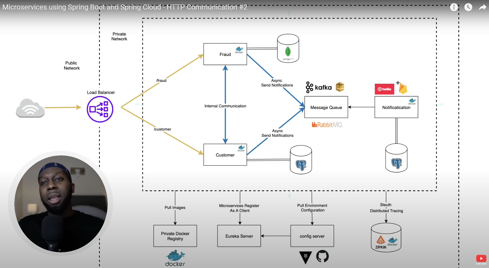

This is a simple practice project that implements two microservices (Customer and Fraud).
They will communicate each other by asynchronous notification using Kafka and RabbitMQ.

This project is based on Amigos code Microservices course (https://www.youtube.com/playlist?list=PLwvrYc43l1Mwqpf9i-1B1gXfMeHOm6DeY)

Diagram:
